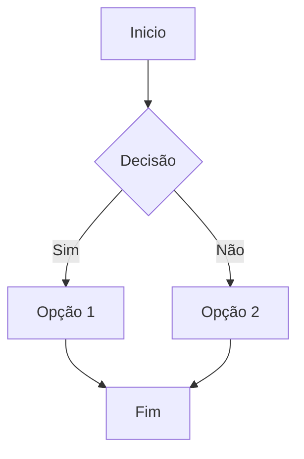

# Gabriel_Hagui


> [!WARNING]
> Em construção

## Diagramas Mermaid

O tema suporta diagramas Mermaid. Basta usar um bloco de código com a linguagem `mermaid`:



Os scripts necessários (CDN Mermaid + inicialização) são carregados nos includes de header. Se quiser desativar, remova as tags correspondentes em `_includes/header-*.html`.

## Estrutura SCSS / CSS

O stylesheet principal agora apenas importa parciais modularizadas em `/_sass/custom/`:

```
style.scss
 ├─ _variables.scss      (CSS custom properties & escala tipográfica)
 ├─ _mixins.scss         (mixins utilitários)
 ├─ _reset.scss          (reset + base global)
 ├─ _layout.scss         (grid principal: container, main, sidebar, content)
 ├─ _header.scss         (branding / logo)
 ├─ _navigation.scss     (nav desktop + mobile toggle)
 ├─ _sections.scss       (seções hero/about)
 ├─ _markdown.scss       (tipografia markdown / TOC / footnotes)
 ├─ _code.scss           (syntax highlight / blocos de código)
 └─ _utilities.scss      (ajustes responsivos & utilidades)
```

Motivações do refactor:
- Separação de responsabilidades para manutenção mais simples.
- Redução de código duplicado e regras órfãs pré-build.
- Facilita tree-shaking futuro ou builds parciais se necessário.

## Lint de Estilo (Stylelint)

Foi adicionado `.stylelintrc.json` com presets `stylelint-config-standard` e `stylelint-config-recommended-scss`, além de ordenação de propriedades (plugin `stylelint-order`). Diretórios gerados (`_site`, `vendor`, `node_modules`) e mapas são ignorados em `.stylelintignore`.

### Executar (exemplo)
Instale dependências (caso ainda não existam em seu setup global):

```bash
npm init -y
npm install --save-dev stylelint stylelint-config-standard stylelint-config-recommended-scss stylelint-order
npx stylelint "neubrutalism_theme/**/*.scss"
```

Ou adicione script ao `package.json`:

```jsonc
"scripts": { "lint:css": "stylelint 'neubrutalism_theme/**/*.scss'" }
```

## Próximos Passos Sugeridos
- Adicionar testes visuais (Percy / Playwright screenshot) para validar regressões.
- Automatizar lint em CI (GitHub Actions) antes do build de Jekyll.
- Considerar tokens de cor gerados via mapa SCSS para dark mode futuro.