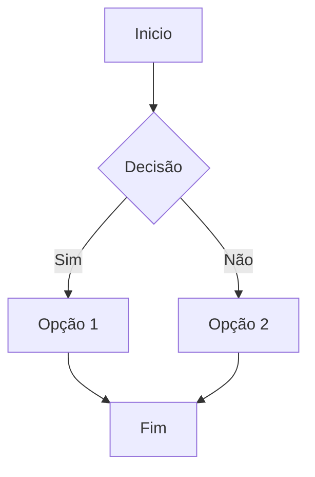

# Gabriel_Hagui

> [!WARNING]
> Em construção

## Diagramas Mermaid

O tema suporta diagramas Mermaid. Basta usar um bloco de código com a linguagem `mermaid`:

Os scripts necessários (CDN Mermaid + inicialização) são carregados nos includes de header. Se quiser desativar, remova as tags correspondentes em `_includes/header-*.html`.