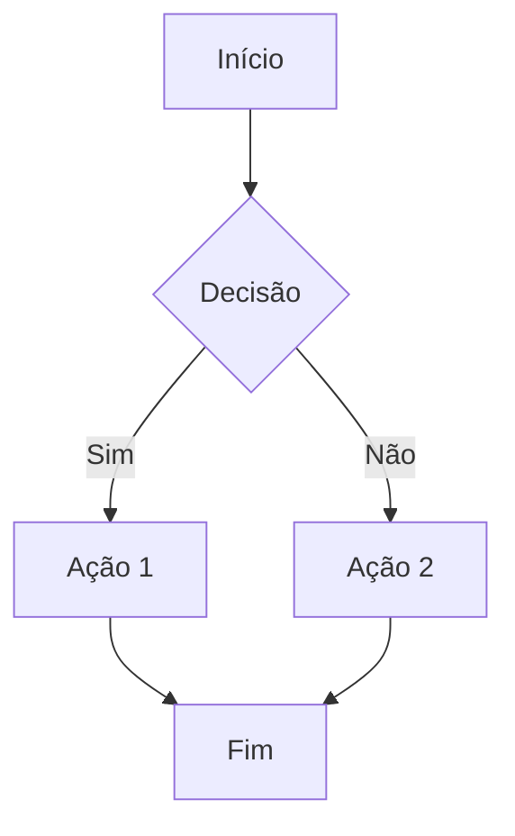

# Exemplos de Markdown Avançado

Este arquivo demonstra todos os formatos markdown suportados pelo tema Neubrutalism.

## Tabelas

| Coluna 1 | Coluna 2 | Coluna 3 |
|----------|----------|----------|
| Dados 1   | Dados 2   | Dados 3   |
| Dados 4   | Dados 5   | Dados 6   |
| Dados 7   | Dados 8   | Dados 9   |
| Dados 10   | Dados 11   | Dados 12   |

## Callouts/Alertas

> [!info] Informação
> Este é um callout de informação com estilo neubrutalist.

> [!success] Sucesso
> Este é um callout de sucesso com cores vibrantes.

> [!warning] Aviso
> Este é um callout de aviso para chamar atenção.

> [!error] Erro
> Este é um callout de erro para situações críticas.

> [!help] Ajuda
> Este é um callout de ajuda com dicas úteis.

## Código

### Código inline
Use `console.log()` para imprimir no console.

### Blocos de código

```javascript
function saudacao(nome) {
    console.log(`Olá, ${nome}!`);
    return `Bem-vindo ao Neubrutalism!`;
}

// Exemplo de uso
const mensagem = saudacao("Desenvolvedor");
```

```python
def fibonacci(n):
    if n <= 1:
        return n
    return fibonacci(n-1) + fibonacci(n-2)

# Exemplo de uso
for i in range(10):
    print(f"F({i}) = {fibonacci(i)}")
```

## Listas

### Lista não ordenada
- Item 1
- Item 2
  - Subitem 2.1
  - Subitem 2.2
- Item 3

### Lista ordenada
1. Primeiro item
2. Segundo item
3. Terceiro item

### Lista de tarefas
- [x] Implementar suporte a tabelas
- [x] Adicionar callouts coloridos
- [x] Configurar syntax highlighting
- [ ] Criar mais exemplos
- [ ] Documentar funcionalidades

## Links e Imagens

[Link para o GitHub](https://github.com)


## Citações
> [!cit] "
> Esta é uma citação simples em markdown.
>
> Pode ter múltiplas linhas e parágrafos.

## Separadores

---

## Notas de rodapé

Este texto tem uma nota de rodapé[^1].

[^1]: Esta é a nota de rodapé que aparece no final do documento.

## Tabela de Conteúdos

*Este seria gerado automaticamente pelo Kramdown se configurado*

## Elementos HTML

<details>
<summary>Clique para expandir</summary>

Conteúdo oculto que pode ser revelado clicando no título.

</details>

## Emojis

🎨 ✨ 🚀 💻 🔥 ⚡️ 🎯 📱 💡 🎪

## Texto formatado

**Texto em negrito** e *texto em itálico*.

~~Texto riscado~~ e `código inline`.

## Matemática

Agora com suporte a MathJax. Exemplos:

Inline: $x = \frac{-b \pm \sqrt{b^2 - 4ac}}{2a}$ dentro de uma frase.

Display:

$$
x = \frac{-b \pm \sqrt{b^2 - 4ac}}{2a}
$$

Outro exemplo inline: $e^{i\pi} + 1 = 0$ e um bloco:

$$
\int_{-\infty}^{\infty} e^{-x^2}\, dx = \sqrt{\pi}
$$

## Diagramas (se suportado)


```mermaid
graph TD
    A[Início] --> B{Decisão}
    B -->|Sim| C[Ação 1]
    B -->|Não| D[Ação 2]
    C --> E[Fim]
    D --> E
```

## Conclusão

Este tema agora suporta todos os formatos markdown avançados com estilo neubrutalist único! 🎨✨
